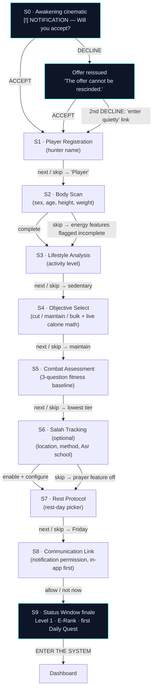

# Onboarding: The Awakening (First-Run Flow Spec)

Complete spec for the first-run experience. The System "awakens" the user as a Player, collects calibration data, and reveals their Status Window. Written to be directly implementable; visual tokens, fonts, and CSS come from `docs/context/solo-leveling-design.md`, formulas from `docs/context/fitness-nutrition-reference.md`, prayer facts from `docs/context/islamic-prayer-reference.md`, and mechanics from `docs/context/gamification-patterns.md`.

## Design goals

1. **Drama without hostage-taking.** Arise's onboarding is praised for its cinematic System framing and criticized for paywalls and rigidity. We keep the ceremony; every data step is skippable with a sane default, there is no paywall, and the whole flow completes in under 3 minutes.
2. **Never lose progress.** Arise's #1 complaint is being forced back through onboarding after logouts/data loss. Every step persists a draft to localStorage immediately; refresh resumes mid-flow; once complete, onboarding never re-triggers.
3. **Honest math, shown on screen.** The calorie goal is computed live with the formula visible — the System "scans" you, but the numbers are real Mifflin-St Jeor.
4. **Respect the sacred.** Prayer setup shifts tone: dignified copy, explicitly optional, explicitly penalty-free. Worship is not a quest.

## Flow overview

Sequence: cinematic → identity → physical calibration (in strict dependency order: body → activity → goal, because the calorie math needs all three) → fitness baseline (sets quest targets) → prayer (separate domain, clearly optional) → rest days (scheduling) → notifications (asked only after the user has seen what notices are for) → Status Window finale.



## Global behavior (applies to every screen)

- **Chrome.** Full-screen takeover on `bg-deep` (`#050810`) with subtle scanlines. Each step is one System window (`.system-panel` + `.clipped`), entering with the standard 150–200ms scale/fade. Data steps S1–S8 show a progress marker top-right in Share Tech Mono: `SYNC 1/8` … `SYNC 8/8`. S0 and S9 show no progress marker (they are ceremony, not chores).
- **Typewriter text.** System copy types at ~18ms/char with a soft terminal tick (muted if notifications/audio not yet permitted — default silent). Tapping/clicking anywhere instantly completes the current typewriter line. `prefers-reduced-motion`: render all text instantly, disable scanlines/sweeps/flashes.
- **Navigation.** Primary action button bottom-center (Orbitron, blue glow). A quieter `[ WITHHOLD ]` skip link bottom-left on every skippable step (all of S1–S8). Back arrow top-left on S1–S8 returns to the previous data step (never back into the cinematic).
- **Draft persistence.** After every step commit, write the partial result to `localStorage["sh.v1.onboarding.draft"]` (JSON, includes `stepReached`). On app load: if `profile.onboardedAt` is set → dashboard; else if a draft exists → resume at `stepReached` with a brief `[SYNCHRONIZATION RESUMED]` toast; else → S0. Never wipe a draft on parse failure — back up the raw string to `sh.v1.onboarding.draft.bak` and restart the flow.
- **Units.** Metric is canonical in storage. S2 has a METRIC/IMPERIAL toggle (persisted as a display preference, default by locale: imperial for `en-US`, metric otherwise). Conversions: 1 kg = 2.2046 lb, 1 cm = 0.3937 in.
- **Copy voice.** Present tense, impersonal, bracketed state changes, address the user as "Player" (or their hunter name after S1). Never chatty, never emoji.

---

## S0 · The Awakening (cinematic)

Purpose: hook. No inputs collected. ~20 seconds if unhurried, skippable to ~3 taps.

Beat sequence (each beat is a typewriter line; a tap completes the line, a second tap advances):

1. Black screen, 1.5s of nothing but scanlines. Then, small and centered:
   `. . .`
2. `[SYSTEM INITIALIZING]`
   Below it, Share Tech Mono, dim: a fake boot line such as `LINK ESTABLISHED · LATENCY 0ms · SOURCE: UNKNOWN`
3. Blue flash (1 frame). A System notification window scales in:

   > `[!] NOTIFICATION`
   >
   > `You have acquired the qualifications to be a Player. Will you accept?`

   Buttons: `[ ACCEPT ]` (blue glow, primary) · `[ DECLINE ]` (dim, secondary).

4. **On ACCEPT:** window flares, then:

   > `You have become a Player.`
   >
   > `The System is designed to assist the development of the Player.`

   Auto-advance to S1 after 2.5s or on tap.

5. **On DECLINE (1st time):** red-bordered warning window, subtle pulse:

   > `[WARNING]`
   >
   > `The offer cannot be rescinded.`
   >
   > `Failure to comply with the System may result in a penalty.`

   Then the beat-3 window re-presents. This is theater — the manhwa's offer is not really refusable.

6. **On DECLINE (2nd time):** same warning, but a quiet text link appears beneath the buttons: `enter quietly` — clicking it accepts without ceremony (skips beat 4) and proceeds to S1. Nobody is ever locked out.

Skip affordance: after beat 2, a dim `SKIP ▸` appears top-right; it jumps straight to beat 3 (the accept prompt is never skippable — it is the consent gate for the whole flow).

Data written: `draft.acceptedAt` (ISO timestamp).

---

## S1 · Player Registration (hunter name) — SYNC 1/8

> `[PLAYER REGISTRATION]`
>
> `State your name. The System will record it.`

| Element | Spec |
|---|---|
| Input | Single text field, placeholder `Player`, autofocus, Rajdhani 600 |
| Validation | Trim; 1–20 chars; allow letters (any script), digits, spaces, `- _ '`; strip control characters. Empty after trim → treat as skip |
| Primary | `[ REGISTER ]` |
| Skip | `[ WITHHOLD ]` → name = `"Player"` |
| On commit | Confirmation line types below the field: `Registered: {name}.` then advance after 1s |

All subsequent System copy substitutes `{name}` where "Player" appears as a direct address (e.g. `Rise, {name}.` in S9). The generic noun "Player" (as a role) stays "Player".

Data: `draft.hunterName: string` (default `"Player"`).

---

## S2 · Body Scan (age / height / weight / sex) — SYNC 2/8

> `[BODY SCAN]`
>
> `Physical data is required to calibrate quest difficulty and energy readings.`
>
> `Data is stored on this device only. It is transmitted nowhere.`

The privacy line is not flavor — the app is localStorage-first and this is a top trust concern for health + prayer apps. Keep it verbatim.

| Field | Input | Validation | Default shown |
|---|---|---|---|
| Sex | Segmented control: `MALE` / `FEMALE` — labeled "Biological sex (used only for the BMR formula)" | required within step | none preselected |
| Age | Numeric stepper/field, years | integer 13–100 | empty |
| Height | Field + unit toggle (cm ⇄ ft/in) | 100–250 cm | empty |
| Weight | Field + unit toggle (kg ⇄ lb) | 30–300 kg | empty |

- Unit toggle (METRIC/IMPERIAL) sits at the top-right of the window and converts live.
- Inline validation errors in System style: `[ERROR: VALUE OUT OF MEASURABLE RANGE]` in `sl-red`, field border red.
- Primary: `[ SUBMIT SCAN ]` — enabled only when all four fields are valid.
- **Skip** (`[ WITHHOLD ]`): a confirm line appears first — `Without a scan, energy readings will be estimates of estimates. Proceed?` `[ PROCEED ]` / `[ RETURN ]`. On proceed: all body fields stored `null`, `energy.estimated = false`, calorie goal falls back to a flat **2000 kcal**, and S3/S4 still run (activity + goal are still collected for later, and the S4 math panel shows the fallback state). The dashboard later surfaces a persistent, dismissible `[BODY SCAN INCOMPLETE — recalibrate in Settings]` notice.

Data: `draft.body = { sex: 'male'|'female'|null, age: number|null, heightCm: number|null, weightKg: number|null }`.

Weight is also the input for MET calorie-burn estimates (`kcal = MET × kg × hours`) throughout the app — if withheld, workout burn estimates display `—` rather than guessing.

---

## S3 · Lifestyle Analysis (activity level) — SYNC 3/8

> `[LIFESTYLE ANALYSIS]`
>
> `How does the Player currently move through the world?`
>
> `Answer honestly. The System detects exaggeration.`

(The second line is fun *and* functional: users systematically overestimate activity — the largest source of TDEE error.)

Radio cards, one per level, factor shown in Share Tech Mono on the right of each card:

| Card label | Sub-label | Factor |
|---|---|---|
| `SEDENTARY` | Little or no exercise | `×1.2` |
| `LIGHTLY ACTIVE` | Light exercise 1–2 days/week | `×1.375` |
| `MODERATELY ACTIVE` | Moderate exercise 3–5 days/week | `×1.55` |
| `ACTIVE` | Hard exercise 6–7 days/week | `×1.725` |
| `VERY ACTIVE` | Hard exercise + physical job | `×1.9` |

- **Default preselected: `SEDENTARY`** (deliberate under-anchor, per fitness reference).
- Primary: `[ CONFIRM ]`. Skip: keeps `sedentary`.

Data: `draft.activityLevel: 'sedentary'|'light'|'moderate'|'active'|'very_active'` (default `'sedentary'`).

---

## S4 · Objective Select (goal → calorie math) — SYNC 4/8

> `[OBJECTIVE SELECT]`
>
> `Declare your objective. The System will set your daily energy quota.`

Three selectable cards:

| Card | Title | Sub-label | Adjustment |
|---|---|---|---|
| Cut | `CUT` | Lose fat. Eat below expenditure. | −400 kcal |
| Maintain | `MAINTAIN` | Hold steady. Recomposition-friendly. | ±0 |
| Bulk | `BULK` | Build mass. Eat above expenditure. | +300 kcal |

**Default preselected: `MAINTAIN`.** Skip keeps maintain.

**Live math panel** below the cards (updates on selection; Share Tech Mono; this is the "math shown" requirement):

```
BMR  (Mifflin-St Jeor) .......... 1,655 kcal
     10×74kg + 6.25×178cm − 5×28yr + 5
× ACTIVITY (lightly active) ..... ×1.375
= TDEE .......................... 2,276 kcal
GOAL ADJUSTMENT (cut) ........... −400
──────────────────────────────────────────
DAILY ENERGY QUOTA .............. ~1,876 kcal
```

- Formula: men `10w + 6.25h − 5a + 5`, women `10w + 6.25h − 5a − 161` (w=kg, h=cm, a=years). Round the final quota to the nearest 10 and prefix with `~` — copy elsewhere must say "estimated".
- **Clamp:** if the quota lands below 1,200 (female) / 1,500 (male), clamp to that floor and show beneath the panel, in `sl-red`: `[NOTICE] Quota clamped to a safe minimum. Consult a professional for aggressive goals.`
- **If body scan was skipped (S2):** the panel shows instead:

```
BODY SCAN ....................... [WITHHELD]
DAILY ENERGY QUOTA .............. 2,000 kcal (default)
Recalibrate in Settings at any time.
```

- Footer, small and dim, on this screen only: `System estimates are not medical advice.`
- Primary: `[ SET QUOTA ]`.

Data: `draft.goal: 'cut'|'maintain'|'bulk'` (default `'maintain'`); computed `draft.energy = { bmr, tdee, calorieGoal, estimated }` where `estimated` is `false` when body was withheld (then `bmr`/`tdee` are `null`, `calorieGoal` = 2000).

---

## S5 · Combat Assessment (fitness baseline → quest targets) — SYNC 5/8

> `[COMBAT ASSESSMENT]`
>
> `Report your current limits. There is no shame in an honest measurement — only in a false one.`

Three questions, each a row of band buttons (single-select):

**Q1 — `Push-ups, one set, to failure:`** `0–5` · `6–15` · `16–30` · `31+`
**Q2 — `Bodyweight squats, one set:`** `0–10` · `11–25` · `26–50` · `51+`
**Q3 — `Sustained cardio:`** `Walking is my speed` · `I can jog 10 minutes` · `I can run 20+ minutes`

Band → initial Daily Quest target mapping (targets are the *whole-day* total, ~1.5–2× the single-set max, spreadable across sets — this scaling keeps day one safely completable):

| Q1 band | Push-up target | | Q2 band | Squat target | Sit-up target | | Q3 band | Cardio target |
|---|---|---|---|---|---|---|---|---|
| 0–5 | 10 | | 0–10 | 15 | 15 | | Walk | 1 km walk |
| 6–15 | 20 | | 11–25 | 25 | 25 | | Jog 10 | 1.5 km run |
| 16–30 | 35 | | 26–50 | 40 | 40 | | Run 20+ | 3 km run |
| 31+ | 50 | | 51+ | 60 | 60 | | | |

(Sit-ups piggyback on the squat band — muscular-endurance profiles correlate well enough for a starting point, and a fourth question isn't worth the friction. Targets grow via the quest system's adaptive difficulty — 85% completion raises targets, <50% eases them — owned by the quest-system spec, not this doc.)

- `fitnessTier` (0–3) = median of the three band indexes (Q3 has 3 bands: index 0/1/2 → treat as 0/1/3 for the median so a strong runner isn't dragged down). Tier is stored for flavor ("assessment grade") and as the adaptive-difficulty seed; it does **not** change RPG stats — everyone starts equal (see S9).
- On answering all three, a preview panel types in:

  > `Calibration complete. Initial Daily Quest targets:`
  >
  > `PUSH-UPS [0/20] · SIT-UPS [0/25] · SQUATS [0/25] · RUN [0/1.5km]`
  >
  > `The full trial — 100 / 100 / 100 / 10km — remains sealed until you are ready.`

  (The last line plants the canonical quest as a long-term aspiration instead of an unsafe default.)
- Primary: `[ ACCEPT CALIBRATION ]`.
- **Skip:** all three default to the lowest band (targets 10/15/15/1 km walk, tier 0). Preview shows: `No assessment recorded. The System assumes nothing and starts you at the foundation.`

Data: `draft.baseline = { pushupBand: 0-3, squatBand: 0-3, cardioBand: 0-2 }`, `draft.fitnessTier: 0|1|2|3`, `draft.initialQuestTargets = { pushups, situps, squats, cardioKm, cardioMode: 'walk'|'run' }`.

---

## S6 · Salah — Prayer Tracking (optional) — SYNC 6/8

**Tone shift.** Same visual chrome, but no gamified flourishes: no flashes, no "quest" wording, quieter entrance animation. Copy is dignified and states the no-penalty rule up front.

> `[SALAH — PRAYER TRACKING]`
>
> `Some disciplines precede the System.`
>
> `If you wish, the System will track the five daily prayers — times for your location, your on-time record, and gentle make-up (qada) reminders.`
>
> `No penalties, no XP loss, no games apply here. This is worship, not a quest.`

Top-level choice: `[ ENABLE TRACKING ]` · `[ NOT FOR ME ]` (the skip — larger and less apologetic than other steps' skip; declining worship tracking must feel completely fine).

**If enabled, the configuration form expands:**

| Field | Input | Behavior |
|---|---|---|
| Location | Primary button `[ USE MY LOCATION ]` (browser geolocation → store coords, call AlAdhan `/timings` by coordinates — preferred, per API reference) + manual fallback: `City` and `Country` text fields | On geolocation denial/failure, fall back to the manual fields with note `Location unavailable — enter your city.` Manual entries are verified with one test call to `timingsByCity`; on failure show `[ERROR: LOCATION NOT RESOLVED — check spelling]` |
| Calculation method | Dropdown of AlAdhan methods (label + region hint, e.g. `ISNA — North America`) | **Default preselected by country heuristic:** US/CA/MX → 2 (ISNA); Europe → 3 (MWL); Saudi/Gulf → 4 (Umm Al-Qura); Pakistan/India/Bangladesh → 1 (Karachi); Indonesia → 20 (KEMENAG); Turkey → 13 (Diyanet); unknown → 3 (MWL). Sub-note: `Match your local mosque — adjustable in Settings.` |
| Asr school | Radio: `Standard (Shafi'i, Maliki, Hanbali)` / `Hanafi (later Asr)` | Default `Standard` (AlAdhan `school=0`) |

- Always pass `method` and `school` explicitly on API calls; never trust `meta` coordinates from `timingsByCity` (documented API quirk).
- On successful test call, confirm quietly: `Times confirmed for {city}. Today's Maghrib: {time}.`
- Primary (when enabled + valid): `[ CONFIRM ]`.
- **Skip / NOT FOR ME:** `prayer.enabled = false`; the prayer panel is hidden app-wide; a Settings entry `Enable prayer tracking` re-runs just this step's form. No nagging, ever.

Data: `draft.prayer = { enabled, coords: {lat,lon}|null, city: string|null, country: string|null, method: number, school: 0|1 }` (defaults when skipped: `{ enabled: false, coords: null, city: null, country: null, method: 3, school: 0 }`).

---

## S7 · Rest Protocol (rest days) — SYNC 7/8

> `[REST PROTOCOL]`
>
> `Even Hunters must recover. Growth occurs during rest, not despite it.`
>
> `Select scheduled rest days. Rest days never break your streak.`

- Seven toggle chips: `SUN MON TUE WED THU FRI SAT`. **Default: `FRI` preselected** (one rest day is the healthy default; Friday aligns with Jumu'ah for this user — builder may confirm, see open questions).
- Constraint: 0–3 rest days. Selecting a 4th shows: `[NOTICE] More than 3 rest days will stall progression. Maximum: 3.`
- Sub-note: `On rest days the Daily Quest is replaced by a Recovery Quest (stretching, hydration, sleep). Completing it is optional — the streak holds either way.`
- Primary: `[ SET PROTOCOL ]`. Skip: keeps `[FRI]`.

This directly answers Arise's top-tier complaint ("rest days punished"). The streak-safety promise in the copy is a hard product guarantee — the streak system must honor it.

Data: `draft.restDays: number[]` (0=Sun … 6=Sat; default `[5]`).

---

## S8 · Communication Link (notifications) — SYNC 8/8

Deliberately last among data steps: by now the user has seen the quest targets and (maybe) prayer times, so the ask is contextualized, not cold. **Never trigger the browser permission prompt without an in-app yes first** (a browser-level denial is near-permanent; the two-step ask protects that).

> `[COMMUNICATION LINK]`
>
> `The System issues transmissions: a Daily Quest notice each morning{, and a warning when Maghrib's short window opens}.`
>
> `One transmission per event. The System does not spam. Permit?`

(The Maghrib clause `{...}` renders only if prayer tracking was enabled in S6.)

- Buttons: `[ OPEN LINK ]` (primary) · `[ REMAIN UNREACHABLE ]` (skip).
- On `[ OPEN LINK ]`: call the browser `Notification.requestPermission()`. Outcomes:
  - `granted` → `Link established.` → advance.
  - `denied` → `Transmission blocked by your browser. Enable it in browser settings if you change your mind.` → advance (store `enabled: false`).
- Skip: `enabled: false`, no browser prompt fired. A Settings entry can re-run the ask later.

Data: `draft.notifications = { enabled: boolean, askedAt: string }`.

---

## S9 · Status Window Revealed (finale)

No progress marker. This is the payoff — spend animation budget here.

Beat sequence:

1. Screen dims to `bg-deep`; a full-width line types:
   `[SYNCHRONIZATION COMPLETE]`
2. Blue flash. The **Status Window** materializes (scale/fade, then per-row stagger ~80ms/row). Numbers count up from 0 to their value over ~600ms with the glow sweep:

   ```
   ┌─ STATUS ─────────────────────────┐
   │  NAME   : {hunterName}           │
   │  LEVEL  : 1                      │
   │  RANK   : E                      │   ← big Orbitron 'E', gray glow
   │  CLASS  : None                   │
   │  TITLE  : The Awakened           │
   │                                  │
   │  STR 10   AGI 10   VIT 10        │
   │  INT 10   SENSE 10  PER 10       │
   │                                  │
   │  XP  25 / 100        [██░░░░░░]  │
   └──────────────────────────────────┘
   ```

   All six stats start at **10** regardless of fitness tier — the assessment scaled the *quests*, not the Player. Everyone's climb starts at the same floor; the numbers that differ are the targets, which is the fair (and safe) place for difference.
3. Reward toast slides in:
   `[Reward Acquired: +25 XP — Awakening]`
   (Seeds the XP bar visibly above zero; with the square-root curve, Level 2 at 100 XP is reachable on day one — the first-week hook.)
4. Second window slides up beneath the status window — the first quest:

   > `[!] NOTIFICATION`
   >
   > `Daily Quest: Strength Training has arrived.`
   >
   > `PUSH-UPS [0/{n}] · SIT-UPS [0/{n}] · SQUATS [0/{n}] · {RUN|WALK} [0/{n}km]`
   >
   > `Complete all items before midnight. Rewards will be delivered.`

   Note the footer says *rewards*, not penalty threats — day one should not open with a warning. (If today is a scheduled rest day, show the Recovery Quest instead: `Daily Quest: Recovery has arrived.` with stretch/hydration/sleep items.)
5. Final line types beneath everything:
   `Rise, {hunterName}.`
   Primary button: `[ ENTER THE SYSTEM ]` → commits everything (see below), clears the draft, routes to the dashboard.

**Commit transaction (atomic, in this order):** write final `profile` (with `onboardedAt` = now), `playerState`, `settings`, today's quest instance → then delete `sh.v1.onboarding.draft`. If any write throws, keep the draft so the flow can resume.

---

## Step order rationale (summary)

| Order | Step | Why here |
|---|---|---|
| S0 | Awakening | Drama first; the accept prompt doubles as consent to begin |
| S1 | Name | Cheapest possible first win; personalizes all later copy |
| S2→S3→S4 | Body → activity → goal | Strict dependency chain: the S4 math panel needs all prior values live |
| S5 | Fitness baseline | Produces the quest preview — the app's core loop shown before any optional asks |
| S6 | Prayer | Separate domain; placed after the game-flavored steps so its tone shift is clean; user is invested enough to consider it seriously but not so deep that skipping feels like breaking flow |
| S7 | Rest days | Scheduling detail; makes sense only after quests exist conceptually |
| S8 | Notifications | Contextualized last — user now knows exactly what a "transmission" would contain |
| S9 | Finale | Payoff; assigns the first quest so the dashboard is never empty |

## Skip / defaults summary (single source of truth)

| Step | Skippable | On skip |
|---|---|---|
| S0 accept | No (consent gate) | 2nd decline reveals `enter quietly` → silent accept |
| S1 name | Yes | `"Player"` |
| S2 body | Yes (with confirm) | body fields `null`; calorie goal 2000 flat; `estimated=false`; dashboard nudge to recalibrate |
| S3 activity | Yes | `sedentary` (×1.2) |
| S4 goal | Yes | `maintain` (±0) |
| S5 baseline | Yes | lowest bands → 10/15/15/1 km walk, tier 0 |
| S6 prayer | Yes (first-class decline) | feature disabled; re-enable in Settings |
| S7 rest days | Yes | `[Friday]` |
| S8 notifications | Yes | off; no browser prompt fired |

## Data model mapping (proposed contract)

No data-model doc exists yet in `docs/design/`; the builder should reconcile these names with the data-model spec when it lands (shape below is the onboarding module's output contract).

```ts
// localStorage keys are versioned: "sh.v1.profile", "sh.v1.playerState", "sh.v1.settings"
// plus transient "sh.v1.onboarding.draft" during the flow.

interface Profile {
  schemaVersion: 1;
  hunterName: string;                       // S1, default "Player"
  createdAt: string;                        // ISO, set at S0 accept
  onboardedAt: string | null;               // ISO, set on S9 commit; non-null = never show onboarding again
  body: {
    sex: 'male' | 'female' | null;          // S2 — Mifflin-St Jeor variant selector
    age: number | null;                     // years
    heightCm: number | null;
    weightKg: number | null;                // also used app-wide for MET burn: kcal = MET × kg × h
  };
  activityLevel: 'sedentary' | 'light' | 'moderate' | 'active' | 'very_active'; // S3
  goal: 'cut' | 'maintain' | 'bulk';        // S4
  energy: {
    bmr: number | null;                     // null if body withheld
    tdee: number | null;
    calorieGoal: number;                    // computed & clamped, or 2000 fallback
    estimated: boolean;                     // false ⇒ show "recalibrate" nudge
  };
  baseline: { pushupBand: number; squatBand: number; cardioBand: number } | null; // S5, null if skipped
  fitnessTier: 0 | 1 | 2 | 3;               // adaptive-difficulty seed
}

interface Settings {
  schemaVersion: 1;
  units: 'metric' | 'imperial';             // display only; storage is metric
  restDays: number[];                       // S7, 0=Sun..6=Sat, default [5], max 3
  prayer: {                                 // S6
    enabled: boolean;
    coords: { lat: number; lon: number } | null;  // preferred over city when present
    city: string | null;
    country: string | null;
    method: number;                         // AlAdhan method id — ALWAYS sent explicitly
    school: 0 | 1;                          // 0 standard, 1 Hanafi — ALWAYS sent explicitly
  };
  notifications: { enabled: boolean; askedAt: string | null };  // S8
}

interface PlayerState {
  schemaVersion: 1;
  level: 1;                                 // at onboarding commit
  xp: 25;                                   // Awakening bonus (square-root curve, k=100)
  rank: 'E';
  stats: { str: 10; agi: 10; vit: 10; int: 10; sense: 10; per: 10 };
  title: 'The Awakened';
  streak: { current: 0; freezes: 2 };       // 2 auto-freezes pre-stocked per gamification spec
}

// S5 output consumed by the quest system to instantiate day one:
interface InitialQuestTargets {
  pushups: number; situps: number; squats: number;
  cardioKm: number; cardioMode: 'walk' | 'run';
}
```

## Edge cases & non-functional requirements

- **Refresh / crash mid-flow:** resume from draft (see Global behavior). Onboarding must never be forcibly repeated — this is the Arise lesson.
- **Offline during S6:** the AlAdhan test call failing due to network shows `[NOTICE: LINK OFFLINE — settings saved, times will sync when connected]` and accepts the configuration unverified rather than blocking.
- **Reduced motion:** all typewriter/flash/count-up effects render instantly; the finale still staggers rows with opacity only.
- **Keyboard/mobile:** every step operable by keyboard (Enter = primary action, Esc = complete typewriter); inputs use appropriate `inputmode` (numeric for age/height/weight).
- **Localization posture:** v1 is English; keep all System copy in a single constants module (`onboardingCopy.ts` or equivalent) so it's editable in one place, since exact copy is spec'd here.
- **Disclaimer placement:** the "not medical advice" line lives on S4 (where numbers are prescribed) and in Settings — not repeated on every screen.

## Open questions for the builder to confirm

1. **Default rest day = Friday** (chosen for Jumu'ah alignment) — confirm with the user, who may prefer Sunday or none.
2. **Cut adjustment fixed at −400 / bulk at +300** (midpoints of the reference ranges) — an "aggressiveness" slider was deliberately cut from v1 onboarding for friction; confirm it's acceptable to defer to Settings.
3. **Sex when body scan skipped:** this spec falls back to a flat 2000 kcal rather than guessing a formula variant — confirm versus an "average of both formulas" approach.
4. **Field/key names** above must be reconciled with the data-model design doc once it exists.
5. **Sound:** typewriter tick + notification chime are spec'd as default-muted; confirm whether any audio ships in v1 at all.
